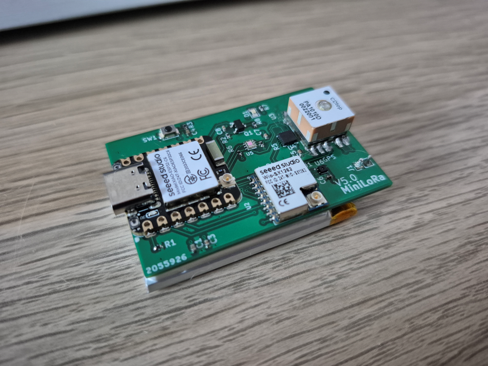
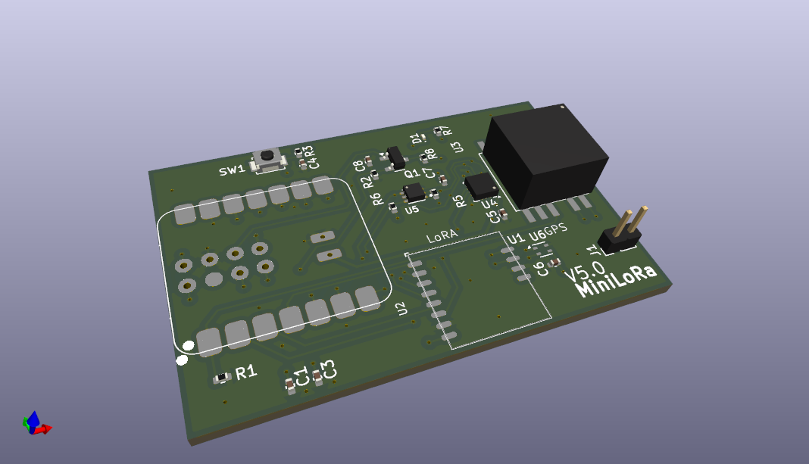
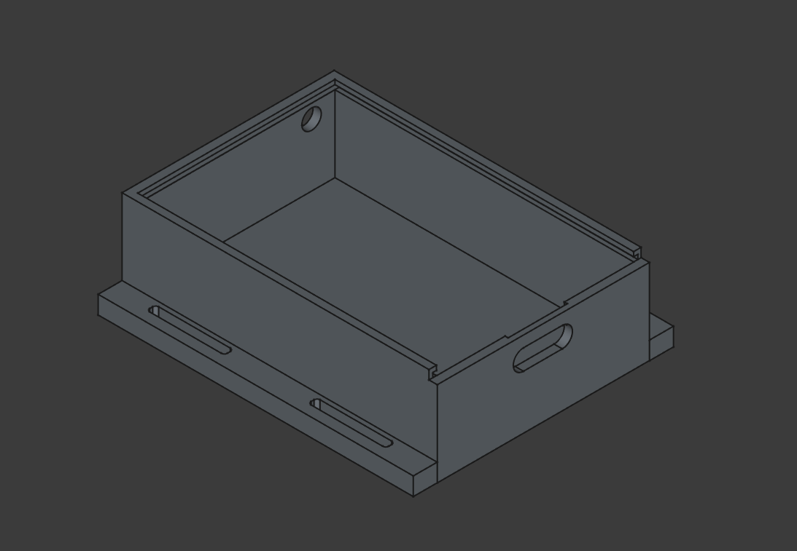

# Introduction

---
<!---
Discord server dedicated to this project :

---
-->
## Table of Contents

- [✨ What's MiniLoRa?](#-whats-MiniLoRa)
- [⚙️ Hardware Overview](#-hardware-overview)
- [💾 Software Overview](#-software-overview)
- [🚀To Do and Next Steps](#-to-do-and-next-steps)

## ✨ What's MiniLoRa?

Small size multi-purpose **ESP32-C6** board with **LoRa** and **2.4 GHz** connectivity.

**Main focus**

* Low power consumption for long battery life
* Multiple wireless connectivity
* Small size

### Features

* ESP32-C6 -> <a href="./DOC/Datasheets/esp32-c6.pdf">XIAO-ESP32C6</a>
  * 32 bits RISC-V Main processor : 160 MHz
  * 32 bits RISC-V Low power processor : 20 Mhz
  * 512 KB RAM
  * 4 MB FLASH
  * Wi-Fi 6 (2.4 GHz)
  * Bluetooth 5 (BLE)
  * Zigbee / Matter / Thread (802.15.4)
  * All 2.4 GHz radios : Internal or external antenna switch via GPIO
* LoRa modem -> <a href="./DOC/Datasheets/Wio-SX1262_Module.pdf">WIO-SX1262</a>
  * LoRaWan capable
  * External Antenna
* GNSS with integrated antenna -> <a href="./DOC/Datasheets/CD-PA1010D.pdf">CD-PA1010D</a>
* Temperature and humidity sensor -> <a href="./DOC/Datasheets/Sensirion_SHT4x.pdf">SHT4X</a>
* Luminosity sensor -> <a href="./DOC/Datasheets/opt3001.pdf">OPT3001</a>
* 3-axis accelerometer -> <a href="./DOC/Datasheets/lis3dh.pdf">LIS3DH</a>
* 2 user accessible LED
* 1 user accessible button
* Voltage reading of the battery
* Integrated BMS and JST connector

## ⚙️ Hardware Overview

**PCB dimension**

| D| mm|
| --- | --- |
| L | 50 |
| W | 32 |
| H | 12,5* |

* including GNSS module and JST connector

**PCB Info**

Design with Kicad 9.0

* Full schematic and design can be found under **HW\PCB**
* Production files for the current batch are also included
* Libraries used can be found under **HW\PCB\lib**
* PDF can be found under : **DOC\Schematics**

**Enclosure Info**

Design with FreeCad 1.0

* Very basic and not finished
* Can be 3D printed with basic HW
* Should be improved in the future
* Thought to be attached to backpack

## 💾 Software Overview

I2C adresses of sensors :

| Sensor| ADD|
| --- | --- |
| GNSS | 0x10 |
| ACC | 0x19 |
| TEMP | 0x44 |
| LUM | 0x47 |

## 🚀To Do and Next Steps

Here are the idea for the next improvement and developpement :

### Software

* Create a first full version in Arduino
* Create a better / smaller / mor realiable version directly with FreeRTOS
* User inteface with one button
* BLE app for phones and PC
* App for configuration via USB-C

### Hardware

* Size can me optimized
* I2C pads for external sensors
* External BMS for energy harversting
* Pressure sensor (or Temp / Hum / Pressure)
* 1-PPS connection to MCU from GNSS for NTP via WiFi 
* GNSS module with external flat antenna

