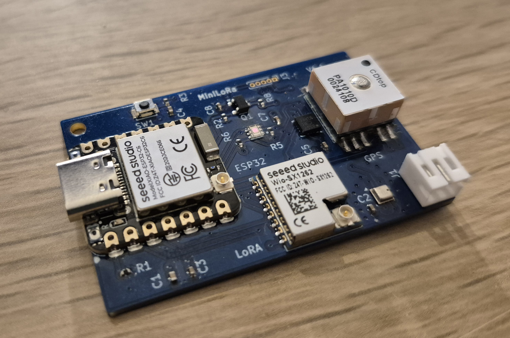
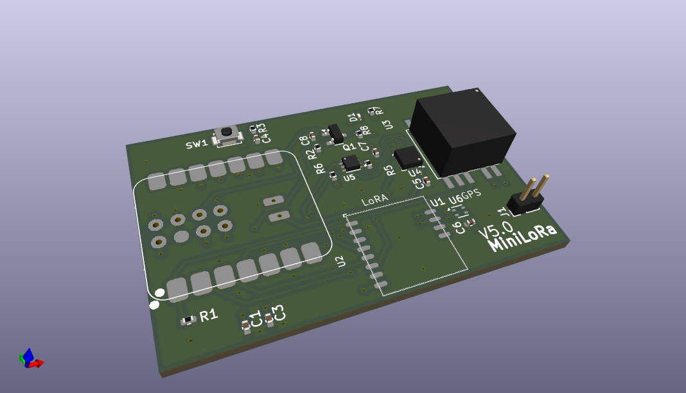
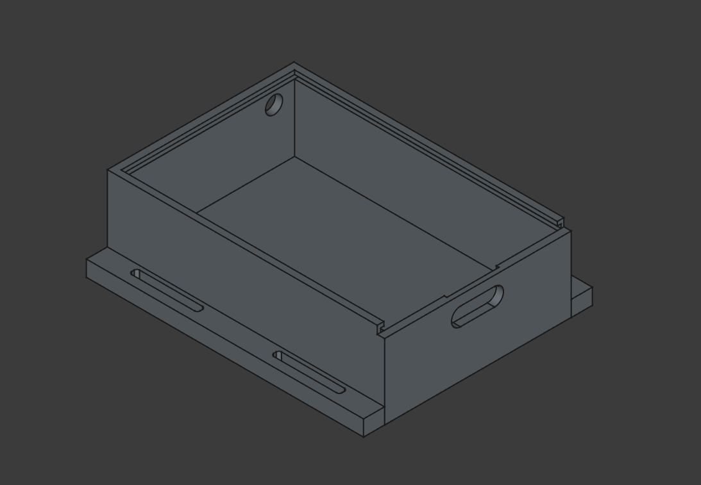

# Introduction

---
<!---
Discord server dedicated to this project :

---
-->
## Table of Contents

- [✨ What's MiniLoRa?](#-whats-MiniLoRa)
- [⚙️ Hardware Overview](#-hardware-overview)
- [💾 Software Overview](#-software-overview)
- [🚀To Do and Next Steps](#-to-do-and-next-steps)

## ✨ What's MiniLoRa?

Small size multi-purpose **ESP32-C6** board with **LoRa** and **2.4 GHz** connectivity.

**Main focus**

* Low power consumption for long battery life
* Multiple wireless connectivity
* Sensors packed
* Small size

### Features

* ESP32-C6 -> <a href="./DOC/Datasheets/esp32-c6.pdf">XIAO-ESP32C6</a>
  * 32 bits RISC-V Main processor : 160 MHz
  * 32 bits RISC-V Low power processor : 20 MHz
  * 512 KB RAM
  * 4 MB FLASH
  * RTC
  * Wi-Fi 6 (2.4 GHz)
  * Bluetooth 5 (BLE)
  * Zigbee / Matter / Thread (802.15.4)
  * All 2.4 GHz radios : Internal or external antenna switch via GPIO
* LoRa modem -> <a href="./DOC/Datasheets/Wio-SX1262_Module.pdf">WIO-SX1262</a>
  * LoRaWan capable
  * External Antenna
* GNSS with integrated antenna and PPS -> <a href="./DOC/Datasheets/CD-PA1010D.pdf">CD-PA1010D</a>
* Temperature, humidity and pressure sensor -> <a href="./DOC/Datasheets/bst-bme280-ds002.pdf">BME280</a>
* Luminosity sensor -> <a href="./DOC/Datasheets/opt3001.pdf">OPT3001</a>
* 3-axis accelerometer -> <a href="./DOC/Datasheets/lis3dh.pdf">LIS3DH</a>
* External connector with : Power, I2C and 1 GPIO
* 1 user accessible LED
* 1 user accessible button
* Voltage reading of the battery
* Integrated BMS and JST connector

## ⚙️ Hardware Overview

**PCB dimension**

| D| mm|
| --- | --- |
| L | 50 |
| W | 32 |
| H | 12,5* |

* including GNSS module and JST connector

**PCB Info**

Design with Kicad 9.0

* Full schematic and design can be found under **HW\PCB**
* Production files for the current batch are also included
* Libraries used can be found under **HW\PCB\lib**
* PDF can be found under : **DOC\Schematics**

**Enclosure Info**

Design with FreeCad 1.0

* Very basic and not finished
* Can be 3D printed with basic HW
* Should be improved in the future
* Thought to be attached to backpack

## 💾 Software Overview

I2C adresses of sensors

| Sensor| ADD|
| --- | --- |
| GNSS | 0x10 |
| ACC | 0x18 |
| TEMP | 0x76 |
| LUM | 0x47 |

GPIO Mapping

| GPIO| Usage| Usable in SW ? | ADC ? | LP GPIO ?| Note|
| --- | --- | --- | --- | --- |---|
| 0 | WakeUp GNSS | X | X | X | |
| 1 | LoRa Busy + ACC Interupt | X | X | X | Mixed both signal|
| 2 | LoRa Reset | X | X | X | |
| 3 | 2.4 GHz switch EN | X | X | X | |
| 4 | PPS | X | X | X | |
| 5 | Bat. Analog  | X |X | X | Read Vbat/2 when active |
| 6 | Bat. Reading En. + External GPIO  | X | X | X | Use to activate External GPIO and EN. Bat reading |
| 7 | User Button | X |  | X | |
| 8 | Not available on XIAO ESP32C6 Module| | | | Strapping pin, HW pull-UP |
| 9 | Boot| | | | |
| 10-11 | N/A on ESP32C6 with Inc. FLASH| | | | |
| 12 | USB DN| | | | Used for serial and prog. |
| 13 | USB DP| | | | Used for serial and prog. |
| 14 | 2.4GHz switch Select| X | | | |
| 15 | Orange LED| X | | | |
| 16 | LoRa DIO1 | X | | | |
| 17 | LoRa SPI Select | X | | | |
| 18 | SPI MOSI | X | | | |
| 19 | SPI SCK | X | | | |
| 20 | SPI MISO | X | | | |
| 21 | LoRa RF Switch | X | | | |
| 22 | I2C SDA | X | | | |
| 23 | i2C SPI | X | | | |
| 24 - 30| Internal SPI FLASH | | | | Not exposed|

External Connector Mapping

1 is defined as the squared one, closest to J3 marking 

| Pin | Usage|
| --- | --- |
| 1 | GND |
| 2 | SCL |
| 3 | SDA |
| 4 | VCC |
| 5 | GPIO6 |

## 🚀To Do and Next Steps

Here are the idea for the next improvement and developpement :

### Software

* Create a first full version in Arduino : Mostly done.
* Architecture
  * Create a core with FreeRTOS or Zephyr
  * Create drivers for all HW
  * File system for sys. files and data files
  * Init routine and deep sleep related routine
  * "1 Button, 1 LED" interface
* Possible SW usage
  * Very long battery life LoRaWAN tracker (all sensors)
  * NTP (GPS with PPS) Wi-Fi server
  * Indoor Zigbee / Wi-Fi / BLE sensor (all but GPS)
  * Outdoor environmental sensor (all sensors)
  * Outdoor offline sensor logging (Storage to FLASH)
  * Anti-theft device (interupt on Acc + all Radios)
* Other related SW
  * BLE App for configuration
  * USB-C (serial) App for configuration  

### Hardware

* Size can me optimized
* GNSS module with external flat antenna
* Replace JST 2.0 by PH1.25 for the Battery connector
* Replace External connector by 1.25mm pitch connector
* Better thermal isolation for BME280
* Replace XIAO module par self-made ESP32C6 module
  * Use ESP32-C6FH8 -> 8 MB of FLASH
  * Remove 2.4 GHz switch to get back 2 GPIO
  * GPIO 8 : could be used for an OUTPUT (to avoid strapping issue)
  * Replace BMS for solar cell use and faster charge : CN3165
  * Chose either chip antenna or external connector 

